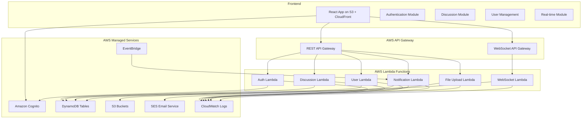

プレビュー：crtl+shift+v

# 設計文書

## 概要

既存のOwlNestアプリケーションを基盤として、包括的な議論プラットフォームサービスに発展させるための設計文書です。現在のPros/Cons形式の議論表示機能を拡張し、ユーザー認証、権限管理、議論作成・管理、リアルタイム更新、フォロー機能、検索機能などを追加します。

### 設計原則

- **段階的拡張**: 既存のコードベースを活用し、段階的に機能を追加
- **モジュラー設計**: 各機能を独立したモジュールとして設計し、保守性を向上
- **スケーラビリティ**: 将来的な機能拡張に対応できる柔軟な設計
- **ユーザビリティ**: 直感的で使いやすいインターフェース設計
- **セキュリティ**: 権限管理とデータ保護を重視した設計

## アーキテクチャ

### AWSサーバーレス システム全体構成



### AWSサービス構成詳細

#### フロントエンド
- **Amazon S3**: 静的ウェブサイトホスティング
- **Amazon CloudFront**: CDN配信、HTTPS対応、キャッシュ最適化
- **Route 53**: ドメイン管理（オプション）

#### 認証・認可
- **Amazon Cognito User Pools**: ユーザー認証・管理
- **Amazon Cognito Identity Pools**: 一時的なAWS認証情報の提供
- **JWT トークン**: Cognitoが自動発行・管理

#### API層
- **Amazon API Gateway (REST)**: HTTP API エンドポイント
- **Amazon API Gateway (WebSocket)**: リアルタイム通信
- **Lambda Authorizer**: カスタム認証・認可ロジック

#### コンピューティング
- **AWS Lambda**: サーバーレス関数実行
  - 従量課金制（実行時間とメモリ使用量のみ）
  - 自動スケーリング
  - 高可用性

#### データストレージ
- **Amazon DynamoDB**: NoSQLデータベース
  - オンデマンド課金モード推奨
  - 自動スケーリング
  - グローバルセカンダリインデックス (GSI) 活用

#### ファイルストレージ
- **Amazon S3**: 画像・ファイル保存
  - Intelligent-Tiering で自動コスト最適化
  - CloudFront との統合

#### 通知・メッセージング
- **Amazon SES**: メール送信
- **Amazon EventBridge**: イベント駆動アーキテクチャ
- **Amazon SNS**: プッシュ通知（将来拡張用）

#### 監視・ログ
- **Amazon CloudWatch**: ログ・メトリクス・アラーム
- **AWS X-Ray**: 分散トレーシング（オプション）

### コスト最適化戦略

#### 固定費用ゼロのサービス構成
1. **Lambda**: 実行時間のみ課金、アイドル時は無料
2. **DynamoDB**: オンデマンドモードで使用量のみ課金
3. **API Gateway**: リクエスト数のみ課金
4. **S3**: ストレージ使用量のみ課金
5. **CloudFront**: データ転送量のみ課金
6. **Cognito**: アクティブユーザー数のみ課金

#### 無料利用枠の活用
- **Lambda**: 月100万リクエスト無料
- **DynamoDB**: 月25GB無料
- **S3**: 月5GB無料
- **CloudFront**: 月50GB無料
- **API Gateway**: 月100万リクエスト無料
- **Cognito**: 月50,000 MAU無料

### フロントエンド アーキテクチャ

現在のReact + TypeScript構成を拡張し、以下の構造を採用：

```
src/
├── components/           # 再利用可能なUIコンポーネント
│   ├── common/          # 共通コンポーネント
│   ├── auth/            # 認証関連コンポーネント
│   ├── discussion/      # 議論関連コンポーネント
│   ├── user/            # ユーザー関連コンポーネント
│   └── forms/           # フォームコンポーネント
├── pages/               # ページコンポーネント
├── hooks/               # カスタムフック
├── services/            # API通信サービス
├── store/               # 状態管理（Context API）
├── types/               # TypeScript型定義
├── utils/               # ユーティリティ関数
└── constants/           # 定数定義
```

## コンポーネントとインターフェース

### 認証システム

#### AuthContext
```typescript
interface AuthContextType {
  user: User | null;
  login: (credentials: LoginCredentials) => Promise<void>;
  logout: () => void;
  register: (userData: RegisterData) => Promise<void>;
  updateUserRole: (userId: string, role: UserRole) => Promise<void>;
  isAuthenticated: boolean;
  hasPermission: (permission: Permission) => boolean;
}
```

#### ユーザー権限管理
```typescript
enum UserRole {
  VIEWER = 'viewer',
  CONTRIBUTOR = 'contributor', 
  CREATOR = 'creator',
  ADMIN = 'admin'
}

interface Permission {
  canView: boolean;
  canPost: boolean;
  canCreateDiscussion: boolean;
  canModerate: boolean;
  canManageUsers: boolean;
}
```

### 議論管理システム

#### DiscussionContext
```typescript
interface DiscussionContextType {
  discussions: Discussion[];
  currentDiscussion: Discussion | null;
  createDiscussion: (data: CreateDiscussionData) => Promise<Discussion>;
  updateDiscussion: (id: string, data: UpdateDiscussionData) => Promise<void>;
  deleteDiscussion: (id: string) => Promise<void>;
  loadDiscussion: (id: string) => Promise<void>;
  filterDiscussions: (filters: DiscussionFilters) => Discussion[];
}
```

#### 投稿管理
```typescript
interface PostContextType {
  posts: Post[];
  createPost: (data: CreatePostData) => Promise<Post>;
  updatePost: (id: string, data: UpdatePostData) => Promise<void>;
  deletePost: (id: string) => Promise<void>;
  filterPosts: (filters: PostFilters) => Post[];
  sortPosts: (sortBy: PostSortOption) => Post[];
}
```

### リアルタイム通信

#### WebSocketContext
```typescript
interface WebSocketContextType {
  isConnected: boolean;
  subscribe: (event: string, callback: (data: any) => void) => void;
  unsubscribe: (event: string) => void;
  emit: (event: string, data: any) => void;
}
```

### フォロー機能

#### FollowContext
```typescript
interface FollowContextType {
  followedUsers: User[];
  followedDiscussions: Discussion[];
  timeline: TimelineItem[];
  followUser: (userId: string) => Promise<void>;
  unfollowUser: (userId: string) => Promise<void>;
  followDiscussion: (discussionId: string) => Promise<void>;
  unfollowDiscussion: (discussionId: string) => Promise<void>;
  loadTimeline: () => Promise<void>;
}
```

## データモデル

### DynamoDB テーブル設計

#### 単一テーブル設計アプローチ
DynamoDBの特性を活かし、単一テーブルでの効率的なデータ管理を採用：

```typescript
// メインテーブル: OwlNestTable
interface DynamoDBItem {
  PK: string;      // Partition Key
  SK: string;      // Sort Key
  GSI1PK?: string; // Global Secondary Index 1 PK
  GSI1SK?: string; // Global Secondary Index 1 SK
  GSI2PK?: string; // Global Secondary Index 2 PK
  GSI2SK?: string; // Global Secondary Index 2 SK
  EntityType: string;
  // その他のデータ属性
}
```

#### ユーザーデータ構造
```typescript
// Cognito User Pools で管理される基本情報
interface CognitoUser {
  sub: string;           // Cognito User ID
  email: string;
  email_verified: boolean;
  username: string;
}

// DynamoDB で管理される拡張情報
interface UserProfile {
  PK: `USER#${userId}`;
  SK: 'PROFILE';
  GSI1PK: `ROLE#${role}`;
  GSI1SK: `USER#${userId}`;
  EntityType: 'UserProfile';
  userId: string;
  role: UserRole;
  displayName: string;
  avatar?: string;
  bio?: string;
  preferences: {
    notifications: NotificationSettings;
    privacy: PrivacySettings;
  };
  createdAt: string;
  updatedAt: string;
}
```

#### 議論データ構造
```typescript
interface DiscussionItem {
  PK: `DISCUSSION#${discussionId}`;
  SK: 'METADATA';
  GSI1PK: `CATEGORY#${categoryId}`;
  GSI1SK: `DISCUSSION#${discussionId}`;
  GSI2PK: `OWNER#${ownerId}`;
  GSI2SK: `DISCUSSION#${discussionId}`;
  EntityType: 'Discussion';
  discussionId: string;
  title: string;
  description: string;
  ownerId: string;
  ownerStance: Stance;
  categories: string[];
  accessControl: AccessControl;
  metadata: {
    createdAt: string;
    updatedAt: string;
    participantCount: number;
    postCount: number;
    isActive: boolean;
  };
}

interface DiscussionPoint {
  PK: `DISCUSSION#${discussionId}`;
  SK: `POINT#${pointId}`;
  GSI1PK: `DISCUSSION#${discussionId}`;
  GSI1SK: `POINT#${order}`;
  EntityType: 'DiscussionPoint';
  pointId: string;
  discussionId: string;
  title: string;
  description?: string;
  parentId?: string;
  level: number;
  order: number;
}

interface BackgroundKnowledge {
  PK: `DISCUSSION#${discussionId}`;
  SK: `KNOWLEDGE#${knowledgeId}`;
  EntityType: 'BackgroundKnowledge';
  knowledgeId: string;
  discussionId: string;
  type: 'text' | 'file' | 'url';
  content: string;
  title?: string;
  order: number;
}
```

### 議論カテゴリ
```typescript
interface Category {
  id: string;
  name: string;
  parentId?: string;
  level: number;
}

const CATEGORIES = {
  POLITICS: {
    id: 'politics',
    name: '政治',
    subcategories: [
      { id: 'national-politics', name: '国の政治' },
      { id: 'local-politics', name: '地方政治' },
      { id: 'international-politics', name: '国際政治' },
      { id: 'elections', name: '選挙' },
      { id: 'politicians-parties', name: '政治家・政党' },
      { id: 'constitution-law', name: '憲法・法制度' }
    ]
  },
  // ... 他のカテゴリ
};
```

### 議論の論点
```typescript
interface DiscussionPoint {
  id: string;
  title: string;
  description?: string;
  parentId?: string;
  level: number;
  order: number;
}
```

#### 投稿データ構造
```typescript
interface PostItem {
  PK: `DISCUSSION#${discussionId}`;
  SK: `POST#${postId}`;
  GSI1PK: `POINT#${discussionPointId}`;
  GSI1SK: `POST#${createdAt}`;
  GSI2PK: `AUTHOR#${authorId}`;
  GSI2SK: `POST#${createdAt}`;
  EntityType: 'Post';
  postId: string;
  discussionId: string;
  discussionPointId: string;
  authorId: string;
  content: {
    text: string;
    formatting: TextFormatting;
    attachments: string[]; // S3 URLs
  };
  stance: Stance;
  replyToId?: string;
  reactions: {
    [userId: string]: ReactionType;
  };
  metadata: {
    createdAt: string;
    updatedAt: string;
    isEdited: boolean;
  };
}

interface PostReaction {
  PK: `POST#${postId}`;
  SK: `REACTION#${userId}`;
  EntityType: 'PostReaction';
  postId: string;
  userId: string;
  reactionType: ReactionType;
  createdAt: string;
}
```

### アクセス制御
```typescript
interface AccessControl {
  type: 'blacklist' | 'whitelist' | 'open';
  userIds: string[];
}
```

#### フォロー・通知データ構造
```typescript
interface FollowItem {
  PK: `USER#${followerId}`;
  SK: `FOLLOW#${targetType}#${targetId}`;
  GSI1PK: `${targetType}#${targetId}`;
  GSI1SK: `FOLLOWER#${followerId}`;
  EntityType: 'Follow';
  followerId: string;
  targetType: 'USER' | 'DISCUSSION';
  targetId: string;
  createdAt: string;
}

interface NotificationItem {
  PK: `USER#${userId}`;
  SK: `NOTIFICATION#${notificationId}`;
  GSI1PK: `USER#${userId}`;
  GSI1SK: `NOTIFICATION#${createdAt}`;
  EntityType: 'Notification';
  notificationId: string;
  userId: string;
  type: NotificationType;
  title: string;
  message: string;
  data: any;
  isRead: boolean;
  createdAt: string;
}

interface TimelineItem {
  PK: `USER#${userId}`;
  SK: `TIMELINE#${timestamp}#${itemId}`;
  EntityType: 'TimelineItem';
  userId: string;
  itemType: 'POST' | 'DISCUSSION';
  itemId: string;
  authorId: string;
  title: string;
  preview: string;
  createdAt: string;
}
```

### DynamoDB インデックス設計

#### メインテーブル
- **Primary Key**: PK (Partition Key), SK (Sort Key)

#### Global Secondary Index 1 (GSI1)
- **Purpose**: カテゴリ別検索、論点別投稿取得
- **Keys**: GSI1PK, GSI1SK

#### Global Secondary Index 2 (GSI2)
- **Purpose**: ユーザー別データ取得、作成者別検索
- **Keys**: GSI2PK, GSI2SK

### Lambda関数設計

#### 認証関連Lambda
```typescript
// cognito-auth-lambda
export const handler = async (event: APIGatewayProxyEvent) => {
  // Cognito JWT トークン検証
  // ユーザー権限チェック
  // DynamoDB からユーザープロファイル取得
};
```

#### 議論管理Lambda
```typescript
// discussion-management-lambda
export const createDiscussion = async (event: APIGatewayProxyEvent) => {
  // 権限チェック
  // バリデーション
  // DynamoDB への保存
  // EventBridge イベント発行
};

export const getDiscussions = async (event: APIGatewayProxyEvent) => {
  // フィルタリング・ソート
  // DynamoDB クエリ実行
  // ページネーション
};
```

#### リアルタイム通信Lambda
```typescript
// websocket-lambda
export const connect = async (event: APIGatewayProxyEvent) => {
  // 接続管理
  // DynamoDB に接続情報保存
};

export const disconnect = async (event: APIGatewayProxyEvent) => {
  // 接続情報削除
};

export const sendMessage = async (event: APIGatewayProxyEvent) => {
  // メッセージ配信
  // 接続中ユーザーへの通知
};
```

## エラーハンドリング

### エラー分類
```typescript
enum ErrorType {
  AUTHENTICATION = 'authentication',
  AUTHORIZATION = 'authorization',
  VALIDATION = 'validation',
  NETWORK = 'network',
  SERVER = 'server',
  NOT_FOUND = 'not_found'
}

interface AppError {
  type: ErrorType;
  message: string;
  code: string;
  details?: any;
}
```

### エラーハンドリング戦略
- **認証エラー**: 自動ログアウトとログインページへのリダイレクト
- **権限エラー**: 適切なエラーメッセージと権限昇格の案内
- **バリデーションエラー**: フォーム内でのインラインエラー表示
- **ネットワークエラー**: 再試行機能とオフライン対応
- **サーバーエラー**: ユーザーフレンドリーなエラーメッセージ

### グローバルエラーハンドラー
```typescript
interface ErrorContextType {
  errors: AppError[];
  addError: (error: AppError) => void;
  removeError: (id: string) => void;
  clearErrors: () => void;
}
```

## テスト戦略

### テストピラミッド
1. **単体テスト (70%)**
   - ユーティリティ関数
   - カスタムフック
   - ビジネスロジック

2. **統合テスト (20%)**
   - コンポーネント間の連携
   - API通信
   - 状態管理

3. **E2Eテスト (10%)**
   - 主要なユーザーフロー
   - 認証フロー
   - 議論作成・投稿フロー

### テストツール
- **Jest**: 単体テスト・統合テスト
- **React Testing Library**: コンポーネントテスト
- **MSW**: APIモック
- **Cypress**: E2Eテスト

### テスト対象
```typescript
// 例: 議論作成機能のテスト
describe('Discussion Creation', () => {
  test('should create discussion with valid data', async () => {
    // テスト実装
  });
  
  test('should validate required fields', async () => {
    // テスト実装
  });
  
  test('should handle permission errors', async () => {
    // テスト実装
  });
});
```

## セキュリティ考慮事項

### 認証・認可
- JWT トークンベース認証
- リフレッシュトークンによる自動更新
- 役割ベースアクセス制御 (RBAC)
- セッション管理

### データ保護
- 入力値のサニタイゼーション
- XSS攻撃対策
- CSRF攻撃対策
- SQLインジェクション対策

### プライバシー
- 個人情報の暗号化
- データ最小化原則
- ユーザー同意管理
- データ削除権の実装

## パフォーマンス最適化

### フロントエンド最適化
- **コード分割**: React.lazy による動的インポート
- **メモ化**: React.memo, useMemo, useCallback の活用
- **仮想化**: 大量データの効率的な表示
- **画像最適化**: 遅延読み込みと圧縮

### データ取得最適化
- **ページネーション**: 大量データの分割取得
- **キャッシュ戦略**: ブラウザキャッシュとサーバーキャッシュ
- **プリフェッチ**: 予測的なデータ取得
- **デバウンス**: 検索機能の最適化

### リアルタイム最適化
- **接続管理**: WebSocket接続の効率的な管理
- **イベント最適化**: 不要なイベントの削減
- **バッチ処理**: 複数更新の一括処理

## 国際化対応

### 多言語サポート
```typescript
interface I18nConfig {
  defaultLanguage: 'ja';
  supportedLanguages: ['ja', 'en'];
  fallbackLanguage: 'ja';
}
```

### 翻訳管理
- 翻訳キーの体系的な管理
- 動的な言語切り替え
- 日付・数値のローカライゼーション

## 監視・ログ

### エラー監視
- フロントエンドエラーの自動収集
- パフォーマンス監視
- ユーザー行動分析

### ログ戦略
```typescript
interface LogEvent {
  level: 'info' | 'warn' | 'error';
  message: string;
  context: any;
  timestamp: Date;
  userId?: string;
}
```

## AWSデプロイメント戦略

### Infrastructure as Code (IaC)
- **AWS CDK (TypeScript)**: インフラストラクチャ定義
- **AWS CloudFormation**: 自動リソース管理
- **AWS Systems Manager Parameter Store**: 設定管理

### 環境構成
```typescript
// CDK Stack 例
export class OwlNestStack extends Stack {
  constructor(scope: Construct, id: string, props: StackProps) {
    super(scope, id, props);

    // DynamoDB Table
    const table = new Table(this, 'OwlNestTable', {
      partitionKey: { name: 'PK', type: AttributeType.STRING },
      sortKey: { name: 'SK', type: AttributeType.STRING },
      billingMode: BillingMode.ON_DEMAND,
      pointInTimeRecovery: true,
    });

    // Lambda Functions
    const discussionLambda = new Function(this, 'DiscussionLambda', {
      runtime: Runtime.NODEJS_18_X,
      handler: 'index.handler',
      code: Code.fromAsset('lambda/discussion'),
      environment: {
        TABLE_NAME: table.tableName,
      },
    });

    // API Gateway
    const api = new RestApi(this, 'OwlNestApi', {
      restApiName: 'OwlNest API',
      description: 'Discussion Platform API',
    });

    // Cognito User Pool
    const userPool = new UserPool(this, 'OwlNestUserPool', {
      userPoolName: 'OwlNestUsers',
      selfSignUpEnabled: true,
      signInAliases: { email: true },
    });

    // S3 + CloudFront
    const websiteBucket = new Bucket(this, 'WebsiteBucket', {
      websiteIndexDocument: 'index.html',
      publicReadAccess: true,
    });

    const distribution = new CloudFrontWebDistribution(this, 'Distribution', {
      originConfigs: [{
        s3OriginSource: { s3BucketSource: websiteBucket },
        behaviors: [{ isDefaultBehavior: true }],
      }],
    });
  }
}
```

### CI/CD パイプライン (AWS CodePipeline)
```yaml
# buildspec.yml
version: 0.2
phases:
  pre_build:
    commands:
      - npm install
      - npm run test
  build:
    commands:
      - npm run build
      - npm run cdk synth
  post_build:
    commands:
      - aws s3 sync build/ s3://$BUCKET_NAME
      - aws cloudfront create-invalidation --distribution-id $DISTRIBUTION_ID --paths "/*"
```

### 監視・アラート設定
```typescript
// CloudWatch Alarms
const errorAlarm = new Alarm(this, 'LambdaErrorAlarm', {
  metric: discussionLambda.metricErrors(),
  threshold: 5,
  evaluationPeriods: 2,
});

const costAlarm = new Alarm(this, 'CostAlarm', {
  metric: new Metric({
    namespace: 'AWS/Billing',
    metricName: 'EstimatedCharges',
    dimensionsMap: { Currency: 'USD' },
  }),
  threshold: 100, // $100 threshold
  evaluationPeriods: 1,
});
```

### セキュリティ設定
```typescript
// IAM Roles with least privilege
const lambdaRole = new Role(this, 'LambdaRole', {
  assumedBy: new ServicePrincipal('lambda.amazonaws.com'),
  managedPolicies: [
    ManagedPolicy.fromAwsManagedPolicyName('service-role/AWSLambdaBasicExecutionRole'),
  ],
  inlinePolicies: {
    DynamoDBAccess: new PolicyDocument({
      statements: [
        new PolicyStatement({
          effect: Effect.ALLOW,
          actions: [
            'dynamodb:GetItem',
            'dynamodb:PutItem',
            'dynamodb:UpdateItem',
            'dynamodb:DeleteItem',
            'dynamodb:Query',
            'dynamodb:Scan',
          ],
          resources: [table.tableArn, `${table.tableArn}/index/*`],
        }),
      ],
    }),
  },
});
```

### コスト監視・最適化
```typescript
// Cost optimization settings
const table = new Table(this, 'OwlNestTable', {
  billingMode: BillingMode.ON_DEMAND, // Pay per request
  pointInTimeRecovery: true,
  timeToLiveAttribute: 'ttl', // Automatic data cleanup
});

// Lambda reserved concurrency for cost control
const discussionLambda = new Function(this, 'DiscussionLambda', {
  reservedConcurrentExecutions: 10, // Limit concurrent executions
  timeout: Duration.seconds(30), // Optimize timeout
  memorySize: 256, // Right-size memory
});
```

### 災害復旧・バックアップ
- **DynamoDB**: Point-in-time recovery 有効化
- **S3**: Cross-region replication（オプション）
- **Lambda**: 複数AZ自動配置
- **CloudFormation**: スタック再作成による迅速復旧

### 段階的デプロイメント
1. **Blue/Green Deployment**: Lambda Aliases使用
2. **Canary Deployment**: API Gateway Stage使用
3. **Feature Flags**: DynamoDB設定テーブル使用

この設計文書は、要件定義書で定義された全ての機能を技術的に実現するための包括的な設計を提供します。既存のOwlNestアプリケーションを基盤として、段階的に機能を拡張していくことで、安定性と保守性を確保しながら包括的な議論プラットフォームを構築できます。