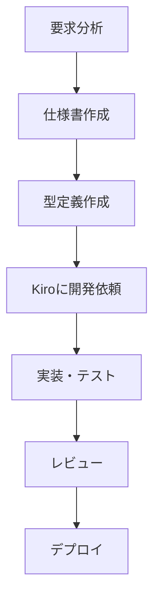
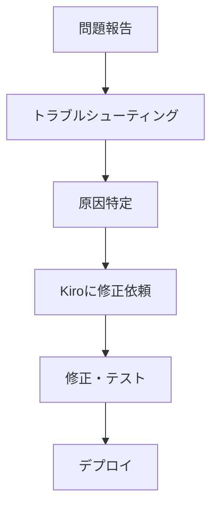
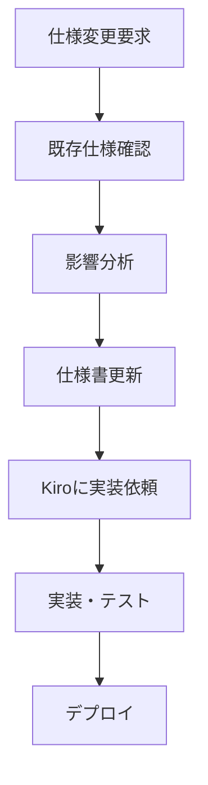

# OwlNest プロジェクトドキュメント

このディレクトリには、OwlNestプロジェクトの開発・保守に関するドキュメントが含まれています。

## 📁 ドキュメント構成

### 📋 プロジェクト概要
- [プロジェクト概要](./PROJECT_OVERVIEW.md) - システム全体像、機能概要、デプロイ手順の包括的ガイド
- [プロジェクト構造ガイド](./PROJECT_DIRECTORY_STRUCTURE.md) - ディレクトリ構成、技術スタック、環境変数の詳細

### 🚀 デプロイメント
- [デプロイメント・CI/CDガイド](./deployment/deployment-guide.md) - CI/CDパイプラインの設定から本番環境へのデプロイメントまでの包括的なガイド

### 💻 開発ガイド
- [Kiro IDE 使用ガイド](./development/kiro-request-guide.md) - Kiroにバグ修正・新機能開発・Spec更新を依頼する統合ガイド
- [仕様管理ガイド](./development/spec-management-guide.md) - requirements.md、design.md、tasks.mdの管理方法
- [トラブルシューティング](./development/troubleshooting.md) - よくある問題と解決方法

## 🎯 使い方

### 新規開発者向け
1. **プロジェクト理解** → [プロジェクト概要](./PROJECT_OVERVIEW.md)でシステム全体を把握
2. **詳細構造** → [プロジェクト構造ガイド](./PROJECT_DIRECTORY_STRUCTURE.md)でディレクトリ構成を確認
3. **開発環境セットアップ** → [デプロイメントガイド](./deployment/deployment-guide.md)の前提条件を参照
4. **Kiro IDEの使い方** → [Kiro使用ガイド](./development/kiro-request-guide.md)を参照

### 機能開発時
1. **仕様書作成** → [仕様管理ガイド](./development/spec-management-guide.md)を参照
2. **型定義作成** → [型定義ガイド](./development/type-definitions-guide.md)を参照
3. **Kiroに開発依頼** → [Kiro使用ガイド](./development/kiro-request-guide.md)を参照

### デプロイメント時
1. **CI/CD設定** → [デプロイメントガイド](./deployment/deployment-guide.md)を参照
2. **本番デプロイ** → [デプロイメントガイド](./deployment/deployment-guide.md)の本番デプロイメント章を参照

### 問題発生時
1. **トラブルシューティング** → [トラブルシューティング](./development/troubleshooting.md)を参照
2. **緊急時対応** → [トラブルシューティング](./development/troubleshooting.md)の緊急時対応章を参照

## 🔧 開発ワークフロー

### 1. 新機能開発フロー

### 2. バグ修正フロー

### 3. 仕様更新フロー

## 📚 技術スタック概要

### フロントエンド
- **React 18** + **TypeScript**: モダンなUI開発
- **Vite**: 高速ビルドツール
- **Material-UI**: UIコンポーネントライブラリ

### バックエンド
- **AWS Lambda**: サーバーレス関数
- **DynamoDB**: NoSQLデータベース
- **API Gateway**: REST API + WebSocket

### インフラ
- **AWS CDK**: インフラストラクチャ as Code
- **CloudFront**: CDN
- **S3**: 静的ファイルホスティング

### 開発ツール
- **Kiro IDE**: AI支援開発環境
- **GitHub Actions**: CI/CD
- **ESLint** + **Prettier**: コード品質管理

## 🚨 重要な注意事項

### セキュリティ
- 環境変数ファイル（`.env*`）には機密情報を含めない
- AWS認証情報は適切に管理する
- 本番環境では最小権限の原則を適用する

### パフォーマンス
- バンドルサイズを定期的に監視する
- DynamoDBの容量設定を適切に管理する
- CloudFrontキャッシュを効果的に活用する

### 品質管理
- すべてのコードはTypeScriptで型安全に記述する
- ESLintルールに従ってコードを記述する
- テストカバレッジを80%以上に維持する

## 📝 ドキュメントの更新

これらのドキュメントは開発プロセスの改善に合わせて定期的に更新してください。

### 更新手順
1. 該当するドキュメントを直接編集
2. または[Kiro使用ガイド](./development/kiro-request-guide.md)を参考にKiroに更新を依頼
3. 変更内容をチームに共有

### 更新タイミング
- 新機能追加時
- 開発プロセス変更時
- 技術スタック更新時
- 問題解決方法の追加時

## 🤝 コントリビューション

ドキュメントの改善提案や新しいガイドの追加は、以下の方法で行ってください：

1. **Issue作成**: 改善提案や不明点をIssueとして報告
2. **Pull Request**: 直接的な改善をPull Requestで提案
3. **Kiro依頼**: [Kiro使用ガイド](./development/kiro-request-guide.md)を参考にKiroに依頼

---

**最終更新**: 2025-08-09  
**バージョン**: 2.0  
**作成者**: OwlNest開発チーム