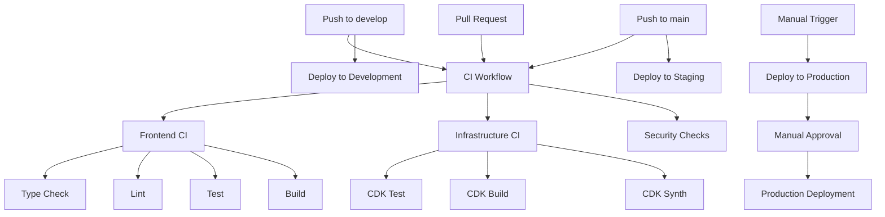
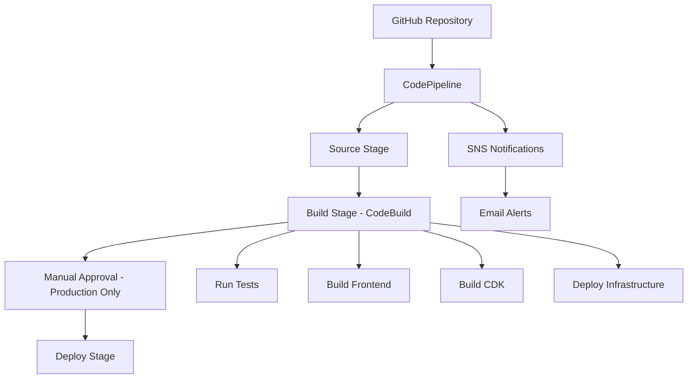

# CI/CD Pipeline Setup Guide

## Overview

This document describes the CI/CD pipeline setup for the OwlNest Discussion Platform. We provide two CI/CD solutions:

1. **GitHub Actions** (Recommended for GitHub-hosted repositories)
2. **AWS CodePipeline** (Alternative solution for AWS-native CI/CD)

## Architecture

### GitHub Actions Pipeline



### AWS CodePipeline Architecture



## GitHub Actions Setup

### Prerequisites

1. GitHub repository with the OwlNest code
2. AWS account with appropriate permissions
3. GitHub repository secrets configured

### Required GitHub Secrets

Configure the following secrets in your GitHub repository settings:

```
AWS_ACCESS_KEY_ID=your-aws-access-key-id
AWS_SECRET_ACCESS_KEY=your-aws-secret-access-key
```

### Environment Configuration

The pipeline supports three environments:

- **Development**: Triggered by pushes to `develop` branch
- **Staging**: Triggered by pushes to `main` branch  
- **Production**: Manual trigger only with approval gate

### Workflow Files

1. **`.github/workflows/ci.yml`**: Main CI workflow
2. **`.github/workflows/cd-development.yml`**: Development deployment
3. **`.github/workflows/cd-staging.yml`**: Staging deployment
4. **`.github/workflows/cd-production.yml`**: Production deployment

### GitHub Actions Features

- ✅ Automated testing (unit, integration, security)
- ✅ Multi-environment deployment
- ✅ Manual approval for production
- ✅ Artifact management
- ✅ Deployment summaries
- ✅ Post-deployment verification

## AWS CodePipeline Setup

### Prerequisites

1. AWS CLI configured with appropriate permissions
2. GitHub personal access token
3. CDK installed and bootstrapped

### Deployment Steps

1. **Store GitHub Token in Secrets Manager**:
   ```bash
   aws secretsmanager create-secret \
     --name github-token \
     --secret-string "your-github-personal-access-token"
   ```

2. **Deploy the Pipeline Stack**:
   ```powershell
   # Windows PowerShell
   cd cdk
   .\scripts\deploy-pipeline.ps1 development default your-github-username owlnest admin@example.com
   ```

3. **Verify Pipeline Creation**:
   - Check AWS CodePipeline console
   - Verify CodeBuild project creation
   - Test pipeline execution

### Pipeline Features

- ✅ Automated builds on push/PR
- ✅ Multi-stage pipeline (Source → Build → Deploy)
- ✅ Manual approval for production
- ✅ SNS notifications
- ✅ CloudWatch monitoring
- ✅ Artifact storage in S3

## Environment-Specific Deployment

### Development Environment

**Trigger**: Push to `develop` branch

**Process**:
1. Run CI checks (tests, linting, security)
2. Build frontend and CDK
3. Deploy to development AWS environment
4. Run smoke tests

**Configuration**:
- Stack name: `OwlNestDev`
- Region: `ap-northeast-1`
- Auto-deployment: Yes

### Staging Environment

**Trigger**: Push to `main` branch

**Process**:
1. Run CI checks
2. Build and deploy to staging
3. Run comprehensive tests (smoke, integration, performance)
4. Generate deployment report

**Configuration**:
- Stack name: `OwlNestStaging`
- Region: `ap-northeast-1`
- Auto-deployment: Yes

### Production Environment

**Trigger**: Manual workflow dispatch

**Process**:
1. Version tag validation
2. Optional CI checks (can be skipped for emergency deployments)
3. Manual approval gate
4. Deploy to production
5. Post-deployment verification
6. Notification of deployment success

**Configuration**:
- Stack name: `OwlNestProd`
- Region: `ap-northeast-1`
- Auto-deployment: No (manual approval required)

## Build Process

### Frontend Build Steps

1. **Install Dependencies**: `npm ci`
2. **Type Checking**: `npm run type-check`
3. **Linting**: `npm run lint`
4. **Unit Tests**: `npm run test:coverage`
5. **Build**: `npm run build`

### Infrastructure Build Steps

1. **Install CDK Dependencies**: `cd cdk && npm ci`
2. **CDK Tests**: `npm test`
3. **CDK Build**: `npm run build`
4. **CDK Synth**: `npx cdk synth`
5. **CDK Deploy**: `npx cdk deploy` (if deployment stage)

### Security Checks

1. **NPM Audit**: Check for vulnerable dependencies
2. **Code Quality**: ESLint rules enforcement
3. **Type Safety**: TypeScript strict mode
4. **Infrastructure Security**: CDK best practices

## Monitoring and Notifications

### GitHub Actions Monitoring

- **Workflow Status**: Visible in GitHub Actions tab
- **Deployment Summaries**: Generated in workflow summary
- **Artifact Storage**: Build artifacts stored for 7-30 days
- **Test Reports**: Coverage reports uploaded as artifacts

### AWS CodePipeline Monitoring

- **CloudWatch Dashboard**: Pipeline metrics and build duration
- **SNS Notifications**: Email alerts for pipeline state changes
- **CloudWatch Logs**: Detailed build logs
- **S3 Artifacts**: Build artifacts with lifecycle management

## Troubleshooting

### Common Issues

1. **AWS Credentials**: Ensure proper IAM permissions
2. **GitHub Token**: Verify token has required scopes
3. **CDK Bootstrap**: Ensure CDK is bootstrapped in target region
4. **Dependencies**: Check for version conflicts

### Debug Commands

```bash
# Check AWS credentials
aws sts get-caller-identity

# Test CDK synthesis
cd cdk && npx cdk synth --context environment=development

# Check pipeline status
aws codepipeline get-pipeline-state --name owlnest-pipeline-development

# View build logs
aws logs describe-log-groups --log-group-name-prefix /aws/codebuild/owlnest-build
```

### Recovery Procedures

1. **Failed Deployment**: Check CloudFormation events and rollback if needed
2. **Pipeline Stuck**: Cancel execution and restart
3. **Build Failures**: Check build logs and fix issues
4. **Permission Issues**: Review IAM roles and policies

## Best Practices

### Code Quality

- ✅ All code must pass linting and type checking
- ✅ Minimum 80% test coverage required
- ✅ Security audit must pass
- ✅ No high-severity vulnerabilities allowed

### Deployment Safety

- ✅ Development environment for testing
- ✅ Staging environment for pre-production validation
- ✅ Manual approval for production deployments
- ✅ Rollback procedures documented
- ✅ Post-deployment verification

### Monitoring

- ✅ Pipeline execution monitoring
- ✅ Build duration tracking
- ✅ Success/failure rate monitoring
- ✅ Cost monitoring for AWS resources

## Cost Optimization

### GitHub Actions

- Free tier: 2,000 minutes/month for private repos
- Efficient workflow design to minimize execution time
- Artifact retention policies to manage storage costs

### AWS CodePipeline

- Pay-per-pipeline execution model
- S3 lifecycle policies for artifact cleanup
- Right-sized CodeBuild instances
- CloudWatch log retention policies

## Security Considerations

### Secrets Management

- GitHub secrets for AWS credentials
- AWS Secrets Manager for sensitive configuration
- No hardcoded secrets in code or configuration

### Access Control

- Least privilege IAM roles
- Environment-specific permissions
- Manual approval gates for production
- Audit logging enabled

### Network Security

- VPC deployment for production (if required)
- Security groups with minimal access
- HTTPS/TLS for all communications

## Maintenance

### Regular Tasks

- [ ] Review and update dependencies monthly
- [ ] Monitor pipeline performance and costs
- [ ] Update GitHub Actions versions quarterly
- [ ] Review and rotate access keys annually
- [ ] Test disaster recovery procedures

### Upgrades

- [ ] CDK version updates
- [ ] Node.js runtime updates
- [ ] GitHub Actions version updates
- [ ] AWS service feature adoption

This CI/CD setup provides a robust, scalable, and secure deployment pipeline for the OwlNest Discussion Platform, supporting multiple environments and deployment strategies.