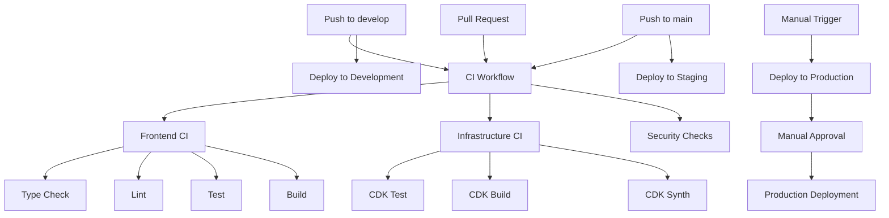
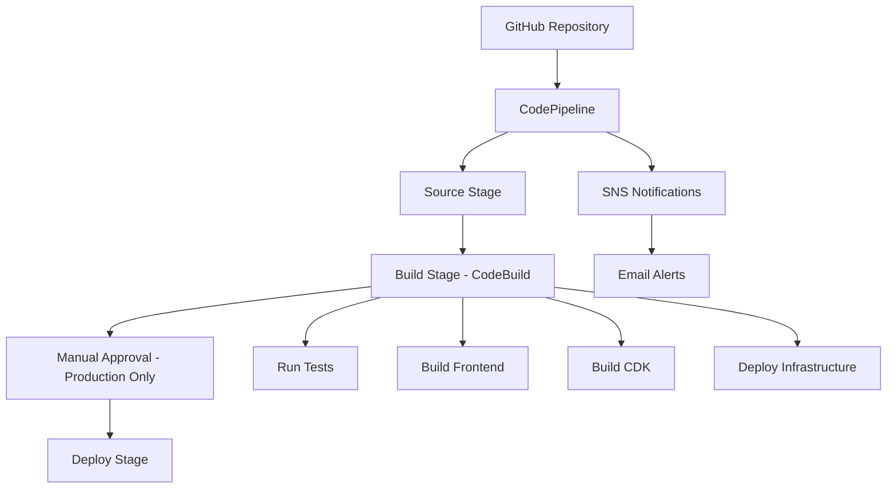

# CI/CD・デプロイメントガイド

> OwlNestプロジェクトのCI/CDパイプライン設定と本番環境デプロイの統合ガイド

## 📋 目次

1. [概要](#概要)
2. [CI/CDアーキテクチャ](#cicdアーキテクチャ)
3. [GitHub Actions セットアップ](#github-actions-セットアップ)
4. [AWS CodePipeline セットアップ](#aws-codepipeline-セットアップ)
5. [環境構成](#環境構成)
6. [本番デプロイ手順](#本番デプロイ手順)
7. [ロールバック手順](#ロールバック手順)
8. [監視・運用](#監視運用)
9. [トラブルシューティング](#トラブルシューティング)

---

## 概要

OwlNestは**Blue-Green デプロイメント**を採用し、ダウンタイムゼロでの本番リリースを実現します。CI/CDパイプラインは GitHub Actions と AWS CodePipeline の2つのソリューションを提供しています。

### デプロイメントフロー
```
開発環境 → ステージング環境 → 本番環境（Blue-Green）
```

### 使用技術
- **AWS CDK**: インフラストラクチャ as Code
- **GitHub Actions / AWS CodePipeline**: CI/CDパイプライン
- **AWS Lambda**: サーバーレス実行環境
- **Amazon S3 + CloudFront**: 静的サイトホスティング
- **Amazon DynamoDB**: データベース

---

## CI/CDアーキテクチャ

### GitHub Actions Pipeline



### AWS CodePipeline Architecture



---

## GitHub Actions セットアップ

### 前提条件

1. GitHub repository with the OwlNest code
2. AWS account with appropriate permissions
3. GitHub repository secrets configured

### 必要な GitHub Secrets

Configure the following secrets in your GitHub repository settings:

```
AWS_ACCESS_KEY_ID=your-aws-access-key-id
AWS_SECRET_ACCESS_KEY=your-aws-secret-access-key
AWS_REGION=ap-northeast-1
GITHUB_TOKEN=your-github-token
```

### 環境構成

The pipeline supports three environments:

- **Development**: Triggered by pushes to `develop` branch
- **Staging**: Triggered by pushes to `main` branch  
- **Production**: Manual trigger only with approval gate

### Workflow Files

1. **`.github/workflows/ci.yml`**: Main CI workflow
2. **`.github/workflows/cd-development.yml`**: Development deployment
3. **`.github/workflows/cd-staging.yml`**: Staging deployment
4. **`.github/workflows/cd-production.yml`**: Production deployment

### GitHub Actions Features

- ✅ Automated testing (unit, integration, security)
- ✅ Multi-environment deployment
- ✅ Manual approval for production
- ✅ Artifact management
- ✅ Deployment summaries
- ✅ Post-deployment verification

---

## AWS CodePipeline セットアップ

### 前提条件

1. AWS CLI configured with appropriate permissions
2. GitHub personal access token
3. CDK installed and bootstrapped

### デプロイ手順

1. **Store GitHub Token in Secrets Manager**:
   ```bash
   aws secretsmanager create-secret \
     --name github-token \
     --secret-string "your-github-personal-access-token"
   ```

2. **Deploy the Pipeline Stack**:
   ```powershell
   # Windows PowerShell
   cd cdk
   .\scripts\deploy-pipeline.ps1 development default your-github-username owlnest admin@example.com
   ```

3. **Verify Pipeline Creation**:
   - Check AWS CodePipeline console
   - Verify CodeBuild project creation
   - Test pipeline execution

### Pipeline Features

- ✅ Automated builds on push/PR
- ✅ Multi-stage pipeline (Source → Build → Deploy)
- ✅ Manual approval for production
- ✅ SNS notifications
- ✅ CloudWatch monitoring
- ✅ Artifact storage in S3

---

## 環境構成

### 環境一覧

| 環境 | 用途 | URL | 自動デプロイ |
|------|------|-----|-------------|
| Development | 開発・テスト | http://localhost:3002 | - |
| Staging | 本番前検証 | https://staging.owlnest.example.com | ✅ |
| Production | 本番環境 | https://owlnest.example.com | 手動承認後 |

### AWS リソース構成

#### フロントエンド
```
CloudFront Distribution
├── S3 Bucket (静的サイト)
├── Lambda@Edge (認証・リダイレクト)
└── Route 53 (DNS)
```

#### バックエンド
```
API Gateway
├── Lambda Functions
│   ├── auth-handler
│   ├── discussion-handler
│   ├── post-handler
│   └── user-handler
├── DynamoDB Tables
│   ├── Users
│   ├── Discussions
│   ├── Posts
│   └── Likes
└── Cognito User Pool
```

#### 監視・ログ
```
CloudWatch
├── Application Logs
├── Performance Metrics
├── Error Tracking
└── Alarms
```

### 必要な AWS 権限

The deployment user/role needs the following permissions:

```json
{
  "Version": "2012-10-17",
  "Statement": [
    {
      "Effect": "Allow",
      "Action": [
        "cloudformation:*",
        "s3:*",
        "lambda:*",
        "apigateway:*",
        "dynamodb:*",
        "cognito-idp:*",
        "cognito-identity:*",
        "cloudfront:*",
        "route53:*",
        "acm:*",
        "wafv2:*",
        "guardduty:*",
        "config:*",
        "cloudtrail:*",
        "backup:*",
        "iam:*",
        "logs:*",
        "events:*",
        "sns:*",
        "budgets:*",
        "xray:*",
        "kms:*",
        "secretsmanager:*",
        "ssm:*",
        "codebuild:*",
        "codepipeline:*"
      ],
      "Resource": "*"
    }
  ]
}
```

---

## 本番デプロイ手順

### 事前準備

#### 必要なツール・権限

```bash
# 必要なツールのインストール確認
node --version    # v18.16.0+
npm --version     # 9.5.1+
aws --version     # AWS CLI v2.0+

# AWS CDK のインストール
npm install -g aws-cdk
cdk --version     # 2.100.0+
```

#### AWS 認証情報の設定
```bash
# AWS CLI の設定
aws configure
# または
export AWS_ACCESS_KEY_ID=your-access-key
export AWS_SECRET_ACCESS_KEY=your-secret-key
export AWS_DEFAULT_REGION=ap-northeast-1
```

#### 環境変数の設定

**本番環境用環境変数**
```bash
# .env.production
VITE_NODE_ENV=production
VITE_DEBUG_MODE=false
VITE_LOG_LEVEL=error

# AWS設定
VITE_AWS_REGION=ap-northeast-1
VITE_AWS_USER_POOL_ID=ap-northeast-1_XXXXXXXXX
VITE_AWS_USER_POOL_CLIENT_ID=XXXXXXXXXXXXXXXXXXXXXXXXXX
VITE_AWS_IDENTITY_POOL_ID=ap-northeast-1:XXXXXXXX-XXXX-XXXX-XXXX-XXXXXXXXXXXX

# API設定
VITE_API_GATEWAY_URL=https://api.owlnest.example.com
VITE_WEBSOCKET_API_URL=wss://ws.owlnest.example.com
VITE_USE_MOCK_API=false

# 機能フラグ
VITE_ENABLE_ANALYTICS=true
VITE_ENABLE_REALTIME=true
VITE_ENABLE_NOTIFICATIONS=true
VITE_ENABLE_FILE_UPLOAD=true
```

**CDK用環境変数**
```bash
# cdk/.env
CDK_DEFAULT_ACCOUNT=123456789012
CDK_DEFAULT_REGION=ap-northeast-1
DOMAIN_NAME=owlnest.example.com
CERTIFICATE_ARN=arn:aws:acm:us-east-1:123456789012:certificate/XXXXXXXX-XXXX-XXXX-XXXX-XXXXXXXXXXXX
```

### 自動デプロイ（推奨）

#### GitHub Actions による自動デプロイ
```yaml
# .github/workflows/deploy-production.yml
name: Deploy to Production

on:
  push:
    branches: [main]
  workflow_dispatch:

jobs:
  deploy:
    runs-on: ubuntu-latest
    steps:
      - uses: actions/checkout@v4
      
      - name: Setup Node.js
        uses: actions/setup-node@v4
        with:
          node-version: '18'
          cache: 'npm'
      
      - name: Install dependencies
        run: |
          npm ci
          cd cdk && npm ci
      
      - name: Run tests
        run: npm run test:ci
      
      - name: Build application
        run: npm run build
      
      - name: Configure AWS credentials
        uses: aws-actions/configure-aws-credentials@v4
        with:
          aws-access-key-id: ${{ secrets.AWS_ACCESS_KEY_ID }}
          aws-secret-access-key: ${{ secrets.AWS_SECRET_ACCESS_KEY }}
          aws-region: ap-northeast-1
      
      - name: Deploy infrastructure
        run: |
          cd cdk
          npx cdk deploy --require-approval never
      
      - name: Deploy frontend
        run: |
          aws s3 sync dist/ s3://owlnest-production-bucket --delete
          aws cloudfront create-invalidation --distribution-id ${{ secrets.CLOUDFRONT_DISTRIBUTION_ID }} --paths "/*"
```

#### デプロイの実行
```bash
# main ブランチにプッシュすると自動実行
git push origin main

# または手動実行
# GitHub Actions の画面から "Deploy to Production" を手動実行
```

### 手動デプロイ

#### 1. コードの準備
```bash
# 最新コードの取得
git checkout main
git pull origin main

# 依存関係のインストール
npm ci
cd cdk && npm ci && cd ..

# テストの実行
npm run test:ci
npm run lint
npm run type-check
```

#### 2. ビルドの実行
```bash
# 本番用ビルド
npm run build

# ビルド結果の確認
ls -la dist/
```

#### 3. インフラストラクチャのデプロイ
```bash
cd cdk

# CDK の初期化（初回のみ）
npx cdk bootstrap

# 変更内容の確認
npx cdk diff

# インフラストラクチャのデプロイ
npx cdk deploy --require-approval never

# デプロイ結果の確認
npx cdk list
```

#### 4. フロントエンドのデプロイ
```bash
# S3 への静的ファイルアップロード
aws s3 sync dist/ s3://owlnest-production-bucket --delete

# CloudFront キャッシュの無効化
aws cloudfront create-invalidation \
  --distribution-id E1234567890123 \
  --paths "/*"

# デプロイ完了の確認
curl -I https://owlnest.example.com
```

### Blue-Green デプロイメント

#### 1. Green 環境の準備
```bash
# Green 環境用のスタックをデプロイ
cd cdk
npx cdk deploy OwlNestStack-Green --context environment=green

# Green 環境への静的ファイルデプロイ
aws s3 sync dist/ s3://owlnest-green-bucket --delete
```

#### 2. Green 環境での検証
```bash
# Green 環境での動作確認
curl -I https://green.owlnest.example.com

# 自動テストの実行
npm run test:e2e -- --baseUrl=https://green.owlnest.example.com
```

#### 3. トラフィックの切り替え
```bash
# Route 53 でトラフィックを Green 環境に切り替え
aws route53 change-resource-record-sets \
  --hosted-zone-id Z1234567890123 \
  --change-batch file://switch-to-green.json

# 切り替え完了の確認
dig owlnest.example.com
```

#### 4. Blue 環境のクリーンアップ
```bash
# 旧 Blue 環境の削除（切り替え成功後）
npx cdk destroy OwlNestStack-Blue --context environment=blue
```

---

## ロールバック手順

### 緊急ロールバック

#### 1. DNS レベルでのロールバック
```bash
# Route 53 で前のバージョンに戻す
aws route53 change-resource-record-sets \
  --hosted-zone-id Z1234567890123 \
  --change-batch file://rollback-to-blue.json

# 変更の確認
dig owlnest.example.com
```

#### 2. CloudFront レベルでのロールバック
```bash
# 前のバージョンの静的ファイルを再デプロイ
aws s3 sync s3://owlnest-backup-bucket/ s3://owlnest-production-bucket/ --delete

# CloudFront キャッシュの無効化
aws cloudfront create-invalidation \
  --distribution-id E1234567890123 \
  --paths "/*"
```

#### 3. Lambda 関数のロールバック
```bash
# 前のバージョンの Lambda 関数に戻す
aws lambda update-function-code \
  --function-name owlnest-auth-handler \
  --s3-bucket owlnest-lambda-backup \
  --s3-key auth-handler-v1.2.3.zip

# 他の Lambda 関数も同様に更新
```

### 計画的ロールバック

#### 1. データベースの整合性確認
```bash
# DynamoDB のデータ整合性チェック
aws dynamodb scan --table-name OwlNest-Users --select COUNT
aws dynamodb scan --table-name OwlNest-Discussions --select COUNT
```

#### 2. 段階的ロールバック
```bash
# 1. 新機能の無効化
# 機能フラグを使用して新機能を無効化

# 2. 前のバージョンのデプロイ
git checkout v1.2.3
npm run build
aws s3 sync dist/ s3://owlnest-production-bucket --delete

# 3. インフラストラクチャのロールバック
cd cdk
git checkout v1.2.3
npx cdk deploy --require-approval never
```

---

## 監視・運用

### デプロイ後の確認項目

#### 1. 基本動作確認
```bash
# ヘルスチェック
curl -f https://owlnest.example.com/health

# API エンドポイントの確認
curl -f https://api.owlnest.example.com/health

# WebSocket 接続の確認
wscat -c wss://ws.owlnest.example.com
```

#### 2. パフォーマンス確認
```bash
# ページ読み込み時間の測定
curl -w "@curl-format.txt" -o /dev/null -s https://owlnest.example.com

# API 応答時間の測定
curl -w "%{time_total}" -o /dev/null -s https://api.owlnest.example.com/discussions
```

#### 3. ログの確認
```bash
# CloudWatch Logs の確認
aws logs describe-log-groups --log-group-name-prefix "/aws/lambda/owlnest"

# エラーログの確認
aws logs filter-log-events \
  --log-group-name "/aws/lambda/owlnest-auth-handler" \
  --filter-pattern "ERROR"
```

### 監視ダッシュボード

#### CloudWatch ダッシュボードの設定
```json
{
  "widgets": [
    {
      "type": "metric",
      "properties": {
        "metrics": [
          ["AWS/Lambda", "Duration", "FunctionName", "owlnest-auth-handler"],
          ["AWS/Lambda", "Errors", "FunctionName", "owlnest-auth-handler"],
          ["AWS/CloudFront", "Requests", "DistributionId", "E1234567890123"],
          ["AWS/DynamoDB", "ConsumedReadCapacityUnits", "TableName", "OwlNest-Users"]
        ],
        "period": 300,
        "stat": "Average",
        "region": "ap-northeast-1",
        "title": "OwlNest Production Metrics"
      }
    }
  ]
}
```

#### アラートの設定
```bash
# Lambda エラー率のアラート
aws cloudwatch put-metric-alarm \
  --alarm-name "OwlNest-Lambda-Errors" \
  --alarm-description "Lambda function error rate" \
  --metric-name Errors \
  --namespace AWS/Lambda \
  --statistic Sum \
  --period 300 \
  --threshold 5 \
  --comparison-operator GreaterThanThreshold \
  --dimensions Name=FunctionName,Value=owlnest-auth-handler \
  --evaluation-periods 2

# API Gateway 応答時間のアラート
aws cloudwatch put-metric-alarm \
  --alarm-name "OwlNest-API-Latency" \
  --alarm-description "API Gateway high latency" \
  --metric-name Latency \
  --namespace AWS/ApiGateway \
  --statistic Average \
  --period 300 \
  --threshold 5000 \
  --comparison-operator GreaterThanThreshold \
  --evaluation-periods 2
```

### セキュリティ設定

#### Web Application Firewall (WAF)

Configured rules include:

- **AWS Managed Core Rule Set**: Common attack patterns
- **Known Bad Inputs**: Malicious request patterns
- **Rate Limiting**: 2000 requests per 5 minutes per IP
- **Geographic Blocking**: Configurable country restrictions

#### GuardDuty

Threat detection for:

- Malicious IP addresses
- Cryptocurrency mining
- Compromised instances
- Data exfiltration attempts

#### AWS Config

Compliance monitoring for:

- S3 bucket public access
- DynamoDB encryption
- Lambda function security
- IAM best practices

#### CloudTrail

Audit logging for:

- API calls
- Console access
- Resource changes
- Authentication events

### バックアップと災害復旧

#### 自動バックアップ

- **DynamoDB**: Point-in-time recovery enabled
- **Daily Backups**: Automated via AWS Backup
- **Weekly Backups**: Long-term retention
- **Cross-region Replication**: For production data

#### 復旧手順

1. **Database Recovery**
   ```bash
   # Restore from point-in-time
   aws dynamodb restore-table-to-point-in-time \
     --source-table-name owlnest-main-table-production \
     --target-table-name owlnest-main-table-restored \
     --restore-date-time 2024-01-01T00:00:00Z
   ```

2. **Application Recovery**
   - Redeploy CDK stacks
   - Update DNS if needed
   - Verify functionality

---

## トラブルシューティング

### よくある問題と解決方法

#### 1. デプロイが失敗する

**症状**: CDK デプロイ時にエラーが発生
```
Error: The stack named OwlNestStack failed to deploy
```

**原因と解決方法**:
```bash
# 1. IAM 権限の確認
aws sts get-caller-identity
aws iam get-user

# 2. CloudFormation スタックの状態確認
aws cloudformation describe-stacks --stack-name OwlNestStack

# 3. ロールバック後に再デプロイ
npx cdk destroy OwlNestStack
npx cdk deploy OwlNestStack
```

#### 2. 静的サイトが表示されない

**症状**: CloudFront 経由でサイトにアクセスできない

**原因と解決方法**:
```bash
# 1. S3 バケットの確認
aws s3 ls s3://owlnest-production-bucket/

# 2. CloudFront の設定確認
aws cloudfront get-distribution --id E1234567890123

# 3. キャッシュの強制無効化
aws cloudfront create-invalidation \
  --distribution-id E1234567890123 \
  --paths "/*"

# 4. DNS の確認
dig owlnest.example.com
nslookup owlnest.example.com
```

#### 3. API が応答しない

**症状**: API Gateway 経由でバックエンドにアクセスできない

**原因と解決方法**:
```bash
# 1. Lambda 関数の状態確認
aws lambda get-function --function-name owlnest-auth-handler

# 2. API Gateway の設定確認
aws apigateway get-rest-apis

# 3. CloudWatch Logs の確認
aws logs describe-log-groups --log-group-name-prefix "/aws/lambda/owlnest"

# 4. Lambda 関数の手動実行テスト
aws lambda invoke \
  --function-name owlnest-auth-handler \
  --payload '{"httpMethod":"GET","path":"/health"}' \
  response.json
```

### デバッグコマンド

```bash
# Check AWS credentials
aws sts get-caller-identity

# Test CDK synthesis
cd cdk && npx cdk synth --context environment=development

# Check pipeline status
aws codepipeline get-pipeline-state --name owlnest-pipeline-development

# View build logs
aws logs describe-log-groups --log-group-name-prefix /aws/codebuild/owlnest-build
```

### 復旧手順

1. **Failed Deployment**: Check CloudFormation events and rollback if needed
2. **Pipeline Stuck**: Cancel execution and restart
3. **Build Failures**: Check build logs and fix issues
4. **Permission Issues**: Review IAM roles and policies

---

## ベストプラクティス

### コード品質

- ✅ All code must pass linting and type checking
- ✅ Minimum 80% test coverage required
- ✅ Security audit must pass
- ✅ No high-severity vulnerabilities allowed

### デプロイメント安全性

- ✅ Development environment for testing
- ✅ Staging environment for pre-production validation
- ✅ Manual approval for production deployments
- ✅ Rollback procedures documented
- ✅ Post-deployment verification

### 監視

- ✅ Pipeline execution monitoring
- ✅ Build duration tracking
- ✅ Success/failure rate monitoring
- ✅ Cost monitoring for AWS resources

### セキュリティ考慮事項

#### Secrets Management

- GitHub secrets for AWS credentials
- AWS Secrets Manager for sensitive configuration
- No hardcoded secrets in code or configuration

#### Access Control

- Least privilege IAM roles
- Environment-specific permissions
- Manual approval gates for production
- Audit logging enabled

#### Network Security

- VPC deployment for production (if required)
- Security groups with minimal access
- HTTPS/TLS for all communications

---

## チェックリスト

### デプロイ前チェックリスト
- [ ] 全てのテストが通過している
- [ ] コードレビューが完了している
- [ ] 環境変数が正しく設定されている
- [ ] データベースマイグレーションが準備されている
- [ ] ロールバック計画が準備されている
- [ ] 監視・アラートが設定されている

### デプロイ後チェックリスト
- [ ] ヘルスチェックが正常に応答する
- [ ] 主要機能が正常に動作する
- [ ] パフォーマンスが要件を満たしている
- [ ] ログにエラーが出力されていない
- [ ] 監視ダッシュボードが正常に表示される
- [ ] アラートが適切に設定されている

### 緊急時対応チェックリスト
- [ ] 問題の影響範囲を特定した
- [ ] ロールバック手順を確認した
- [ ] 関係者に状況を報告した
- [ ] ロールバックを実行した
- [ ] 問題の解決を確認した
- [ ] 事後分析を実施した

---

**最終更新**: 2025-08-06  
**バージョン**: 2.0  
**作成者**: OwlNest開発チーム