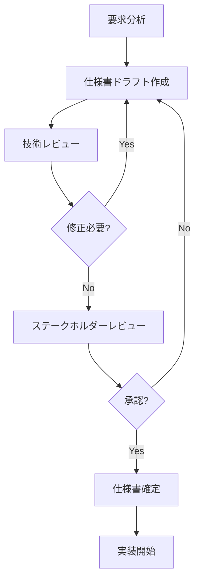
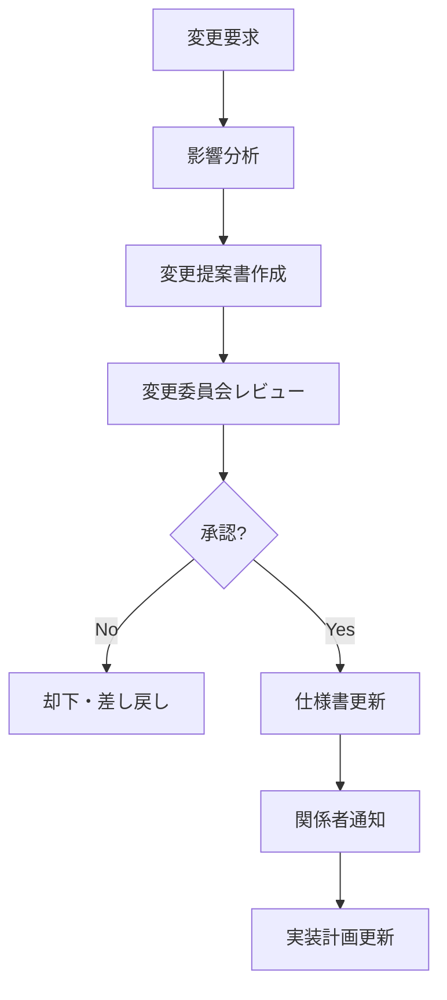

# 仕様管理ガイド

## 概要
このドキュメントでは、OwlNestプロジェクトにおける仕様書の作成、管理、更新プロセスについて説明します。

## 仕様管理の目的
- 開発チーム間での認識統一
- 機能要件の明確化
- 変更履歴の追跡
- 品質保証の基盤

## 仕様書の構造

### 1. ディレクトリ構成
```
.kiro/specs/
├── discussion-platform-enhancement/
│   ├── requirements.md
│   ├── user-stories.md
│   ├── acceptance-criteria.md
│   └── technical-specs.md
├── post-type-architecture/
│   ├── requirements.md
│   ├── api-design.md
│   ├── data-model.md
│   └── implementation-plan.md
└── templates/
    ├── feature-spec-template.md
    ├── api-spec-template.md
    └── user-story-template.md
```

### 2. 仕様書テンプレート

#### 機能仕様書テンプレート
```markdown
# [機能名] 仕様書

## 基本情報
- **作成日**: YYYY-MM-DD
- **作成者**: [作成者名]
- **最終更新**: YYYY-MM-DD
- **ステータス**: Draft/Review/Approved/Implemented
- **優先度**: High/Medium/Low

## 概要
[機能の概要を簡潔に記述]

## 背景・目的
### 背景
[なぜこの機能が必要なのか]

### 目的
[この機能で達成したいこと]

### 成功指標
- [測定可能な指標1]
- [測定可能な指標2]

## 機能要件
### 基本機能
- [ ] 要件1: [詳細な説明]
- [ ] 要件2: [詳細な説明]

### 詳細機能
- [ ] 詳細要件1: [詳細な説明]
- [ ] 詳細要件2: [詳細な説明]

## 非機能要件
### パフォーマンス
- レスポンス時間: [具体的な数値]
- スループット: [具体的な数値]
- 同時接続数: [具体的な数値]

### セキュリティ
- 認証方式: [認証方法]
- 認可レベル: [権限設定]
- データ保護: [暗号化等]

### 可用性
- 稼働率: [目標値]
- 復旧時間: [目標値]
- バックアップ: [方針]

## ユーザーストーリー
### ストーリー1
**As a** [ユーザータイプ]
**I want** [やりたいこと]
**So that** [目的・価値]

**受け入れ条件**:
- [ ] 条件1
- [ ] 条件2

### ストーリー2
[同様の形式で記述]

## UI/UX設計
### 画面構成
[画面の構成要素]

### ユーザーフロー
[ユーザーの操作フロー]

### デザインガイドライン
[デザインの方針]

## 技術仕様
### アーキテクチャ
[システム構成]

### API設計
[API仕様]

### データモデル
[データ構造]

### 技術選択
[使用技術とその理由]

## 実装計画
### フェーズ分け
#### フェーズ1: [期間]
- [ ] タスク1
- [ ] タスク2

#### フェーズ2: [期間]
- [ ] タスク3
- [ ] タスク4

### 依存関係
[他の機能との依存関係]

### リスク
[想定されるリスクと対策]

## テスト計画
### テスト戦略
[テストの方針]

### テストケース
#### 正常系
- [ ] テストケース1
- [ ] テストケース2

#### 異常系
- [ ] エラーケース1
- [ ] エラーケース2

### パフォーマンステスト
[負荷テストの計画]

## 運用・保守
### 監視項目
[監視すべき項目]

### アラート設定
[アラートの条件]

### 保守計画
[定期的な保守作業]

## 変更履歴
| 日付 | 変更者 | 変更内容 | バージョン |
|------|--------|----------|------------|
| YYYY-MM-DD | [名前] | [変更内容] | v1.0 |

## 承認
- **レビュー者**: [名前] - [日付]
- **承認者**: [名前] - [日付]
```

## 仕様管理プロセス

### 1. 仕様書作成フロー


### 2. レビュープロセス

#### 技術レビュー
- **目的**: 技術的実現可能性の確認
- **参加者**: 技術リード、アーキテクト
- **チェック項目**:
  - 技術選択の妥当性
  - パフォーマンス要件の実現可能性
  - セキュリティ要件の充足
  - 既存システムとの整合性

#### ステークホルダーレビュー
- **目的**: ビジネス要件の確認
- **参加者**: プロダクトオーナー、ビジネス担当者
- **チェック項目**:
  - ビジネス価値の妥当性
  - ユーザー体験の適切性
  - 優先度の妥当性
  - ROIの妥当性

### 3. 変更管理プロセス


## 品質管理

### 1. 仕様書品質チェックリスト

#### 完全性
- [ ] すべての機能要件が記載されている
- [ ] 非機能要件が明確に定義されている
- [ ] 受け入れ条件が具体的である
- [ ] テストケースが網羅的である

#### 一貫性
- [ ] 用語の使用が統一されている
- [ ] 他の仕様書との矛盾がない
- [ ] データモデルが整合している
- [ ] API仕様が一貫している

#### 明確性
- [ ] 曖昧な表現がない
- [ ] 具体的な数値が記載されている
- [ ] 図表が適切に使用されている
- [ ] 専門用語が説明されている

#### 実現可能性
- [ ] 技術的に実現可能である
- [ ] リソース制約を考慮している
- [ ] スケジュールが現実的である
- [ ] 依存関係が明確である

### 2. メトリクス管理

#### 仕様書品質メトリクス
- 仕様書完成度: 完了項目数 / 全項目数
- レビュー指摘事項数: 重大 / 軽微
- 変更要求数: 承認 / 却下
- 実装との乖離率: 乖離項目数 / 全項目数

#### プロセス効率メトリクス
- 仕様書作成時間: 平均作成時間
- レビュー時間: 平均レビュー時間
- 承認までの期間: 作成から承認まで
- 変更頻度: 月次変更回数

## ツール活用

### 1. 仕様書管理ツール

#### Markdown + Git
```bash
# 仕様書の作成
git checkout -b feature/new-spec
# 編集作業
git add .kiro/specs/new-feature/
git commit -m "Add new feature specification"
git push origin feature/new-spec
# プルリクエスト作成
```

#### 自動化スクリプト
```bash
#!/bin/bash
# 仕様書テンプレート生成スクリプト
SPEC_NAME=$1
SPEC_DIR=".kiro/specs/${SPEC_NAME}"
mkdir -p "${SPEC_DIR}"
cp templates/feature-spec-template.md "${SPEC_DIR}/requirements.md"
cp templates/user-story-template.md "${SPEC_DIR}/user-stories.md"
echo "Specification template created: ${SPEC_DIR}"
```

### 2. レビュー支援ツール

#### GitHub Pull Request Template
```markdown
## 仕様書レビューチェックリスト
### 完全性
- [ ] 機能要件が完全に記載されている
- [ ] 非機能要件が明確である
- [ ] テストケースが網羅的である

### 一貫性
- [ ] 用語使用が統一されている
- [ ] 他仕様書との矛盾がない
- [ ] データモデルが整合している

### 明確性
- [ ] 曖昧な表現がない
- [ ] 具体的な数値が記載されている
- [ ] 図表が適切である

### 実現可能性
- [ ] 技術的に実現可能である
- [ ] リソース制約を考慮している
- [ ] スケジュールが現実的である
```

## ベストプラクティス

### 1. 仕様書作成
- **段階的詳細化**: 概要から詳細へ段階的に記述
- **ステークホルダー参加**: 関係者を巻き込んだ作成
- **継続的更新**: 実装中の学びを反映
- **視覚化**: 図表を活用した分かりやすい表現

### 2. レビュー
- **多角的視点**: 技術・ビジネス両面からのレビュー
- **建設的フィードバック**: 改善提案を含む指摘
- **タイムリーなレビュー**: 迅速なフィードバック
- **記録保持**: レビュー結果の文書化

### 3. 変更管理
- **影響分析**: 変更の影響範囲を事前評価
- **段階的変更**: 大きな変更は段階的に実施
- **コミュニケーション**: 変更内容の適切な共有
- **バージョン管理**: 変更履歴の適切な記録

## トラブルシューティング

### 1. よくある問題と対策

#### 仕様書が曖昧
**問題**: 要件が曖昧で実装者が困る
**対策**: 
- 具体的な数値や条件を記載
- 受け入れ条件を明確化
- プロトタイプやモックアップを活用

#### 仕様変更が頻繁
**問題**: 仕様変更が多く開発が進まない
**対策**:
- 初期段階での十分な要求分析
- ステークホルダーとの密な連携
- 変更管理プロセスの厳格化

#### レビューが形骸化
**問題**: レビューが形式的で品質向上に寄与しない
**対策**:
- チェックリストの活用
- レビュー観点の明確化
- レビュー結果のフォローアップ

### 2. 品質向上施策
- 定期的な仕様書品質監査
- ベストプラクティスの共有
- ツールの継続的改善
- 教育・トレーニングの実施

## まとめ
効果的な仕様管理は、プロジェクトの成功に不可欠です。適切なプロセスとツールを活用し、継続的な改善を行うことで、高品質な仕様書を維持できます。